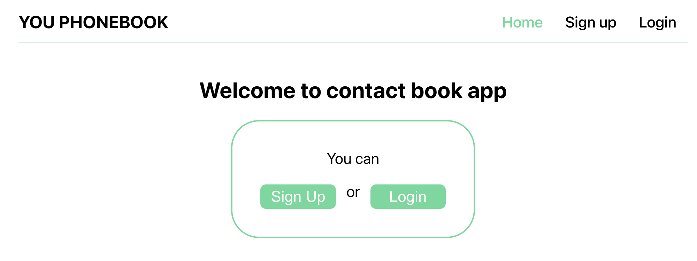
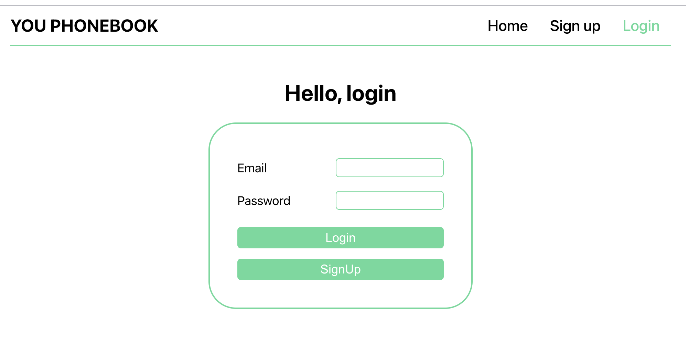

# React "Phone Book" pet project

This project was created to demonstrate technical skills in React and the
ability to register and log in to the site.

<h2>
Used technologies
</h2>

### In the project the following technologies are used: React, Redux Toolkit, axios, Rest API. Used backend <a href='https://connections-api.herokuapp.com/docs/#/' target="_blank">herokuapp</a>

# Project functionality

### In `home page` you can: sign up or login in site

### `Registration` page

### `Login` page

### In `authorized home` page you can go to contact or log out of the account

### In `contacts` page you can `add new contact`, `delete` exist contact and `filter` you contact list

### If you enter the wrong address in the address bar, you will be redirected to the information page where it is written that the `page was not found`

## Thank you for visiting my project and this repository
